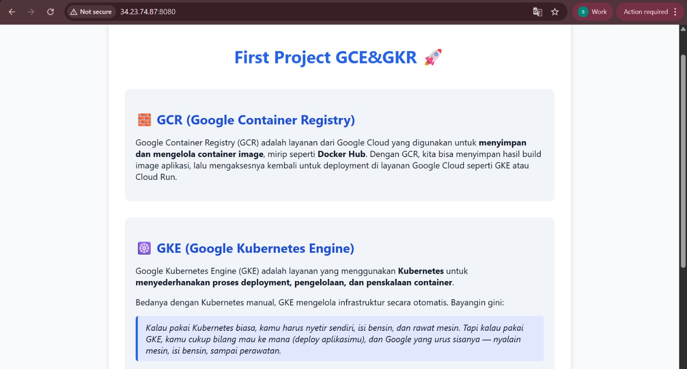

# GCR & GKE PROJECT

## Description
- Google Container Registry (GCR) – for storing and managing container images
- Google Kubernetes Engine (GKE) – for deploying and managing containers in a Kubernetes cluster managed by Google

The application itself is a simple Node.js + Express web app that displays information about GCR & GKE.

## The Stack
- Docker – to build and package the app into a container image
- Google Container Registry (GCR) – for storing Docker images
- Google Kubernetes Engine (GKE) – for running containers in a managed Kubernetes cluster

## Configuration
### Build & Push Image to GCR
Build the docker image
```
docker build -t app:v1 .
```
Tag image for GCR
```
docker tag app:v1 gcr.io/$GOOGLE_CLOUD_PROJECT/app:v1
```
Push image to GCR
```
docker push gcr.io/$GOOGLE_CLOUD_PROJECT/app:v1
```

### Cluster Configuration
Create GKE Cluster
```
gcloud container clusters create hello-world \
    --num-nodes 2 \
    --machine-type e2-medium \
    --zone us-east1-d
```
Connect kubectl to the Cluster
```
gcloud container clusters get-credentials hello-world --zone us-east1-d
```
Deploy the Application
```
kubectl create deployment app \
    --image=gcr.io/PROJECT_ID/app:v1
```
Expose Deployment using LoadBalancer
```
kubectl expose deployment app \
    --type=LoadBalancer \
    --port 8080
```
Check service and access in browser using EXTERNAL-IP
```
kubectl get svc
```

### Scale the Service
Set the number of replicas for pod
```
kubectl scale deployment app --replicas=4
```
Check the deployment and pod
```
kuebctl get deployment
kubectl get po
```



